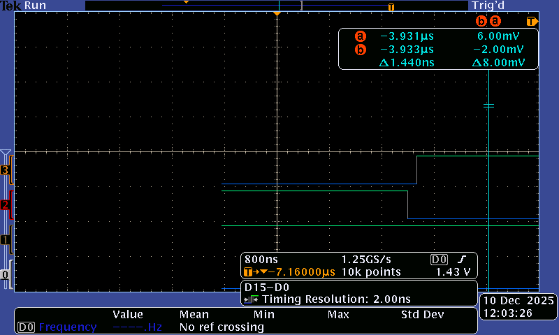
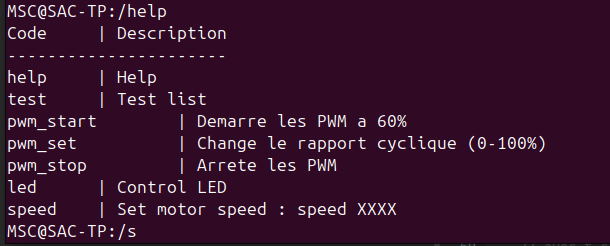
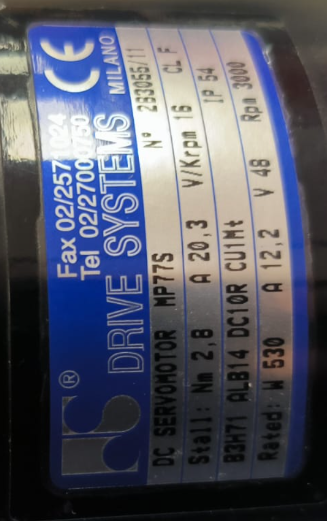
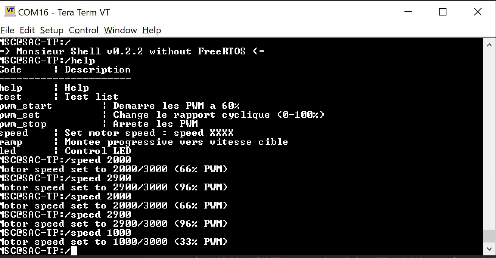
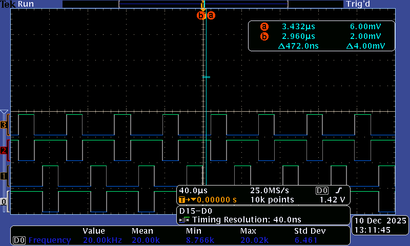
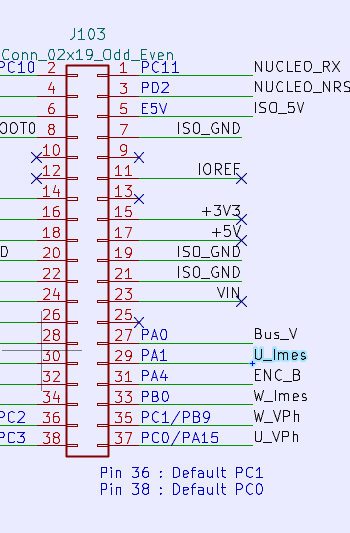
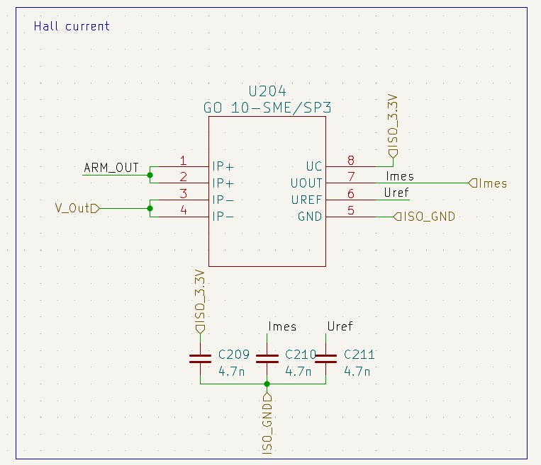
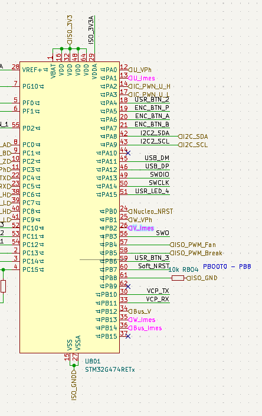

# CR TP Système d'acquisition 

## Sédrenn Labrousse & Mohamed Amin El Haid

### Présentation
Dans le cadre du module de Systèmes Asservis Commandés (SAC), ce travail pratique a pour objectif de mettre en œuvre la commande d’un hacheur complet à l’aide d’une carte Nucleo-STM32G474RE.
L’objectif principal est de réaliser la commande complémentaire décalée des quatre transistors du hacheur, d’assurer l’acquisition des capteurs, puis de développer un asservissement en temps réel.
Le projet est mené à travers un environnement STM32CubeIDE, entièrement versionné sur un dépôt GitHub partagé avec l’enseignant dès la première séance.

--- 
# Préparation prise en main 
### Test du Shell

Après avoir branché la carte et lancé un terminal (dans mon cas, minicom) nous pouvons tester le Shell proposé dans le code :

On voit bien sur la paillasse le on et off de la led et la fonction test renvoie les valeurs demandées.

# 6. Commande MCC basique
## 6.1. Génération de 4 PWM

### dead time

Pour le temps mort minimum nous allons nous référer à la data sheet des transistors utilisés : IRF540N
On rappelle qu'un deadtime minimal doit couvrir le temps nécessaire pour que le transistor précédemment conducteur soit réellement fermé avant d’activer l’autre transistor

Sur la datasheet on trouve :  
td(on) Turn-On Delay Time –––   11 ns–––  
tr Rise Time –––                35 ns–––  
td(off) Turn-Off Delay Time ––– 39 ns–––   
tf Fall Time –––                35 ns––– 

Donc pour un transistor seul, on a comme temps pour cesser la conduction :  
td(off) + tf + td(on)= 39 ns + 35 ns + 11 ns = 85 ns

Pour la partie Drain-Source :  
trr Reverse Recovery Time ––– 115 ––– max  170 ns

Donc on sait que théoriquement le transistor peut avoir des résidus de courant pendant 244ns.  
Un Dead time recommandé pourrait être 300ns

On sait que notre PWM est à 20kHz, donc avec des périodes de 50us.

On se fixera sur un dead time de 120ns environ.

--- 
### Génération
On génère 4 PWM : 

Mais ces dernières ne pourront pas marcher. Le deuxième signal (1N) doit etre le complémentaire du premier (1) ce qui est le cas. 
Mais le 3 eme signal (2) doit etre égal à la complementaire de 1 (1N) fois (t-T/2) ou T est la période.
Donc décalé de 180 degré. 

On règle ca : 

Avec le dead time convenu : 

--- 

### 6.2 Commande de vitesse
Via la lisaison UART, nous allons contrôler la comamnde. 

A ce stade, nous avons les commandes shell suivantes : 

En utilisant speed on peut maintenant definir la vitesse du moteur. 
En sachant que sa vitesse max est 3000 tr/min d'après son etiquette : 

Donc la commande speed prend en compte des valeurs entre 0 et 3000 puis les bascules en pourcentage pour le rapport cyclique. 

Ici par exemple, pour speed 1000 : 

--- 
### 6.3 Premiers tests

On fait les branchements du moteur avec le reste du circuit : 

Puis on fait les tests à 50% et 70% de duty cycle. 

(quand on le fait dans l'autre sens, le moteur s'arrête à 50%)

le problème qu'on est sensé voir est un pique de courant lorsque l'on change trop vite le rapport cyclique. On essaie avec une sonde de courant sans résultat visible.

On peut le voir avec l'ADC sur la carte. D'après le Kicad, on peut le trouver sur PA1 :

Mais ce problème est réel, c'est pourquoi il faut le regler, notamment en faisant un changement de vitesse plus doux, en escalier.

# 7. Commande en boucle ouverte, mesure de Vitesse et de courant

## 7.1. Commande de la vitesse

## 7.2. Mesure de courant

On doit mesurer les courants des 3 phases, U, V, W 

d'après le routage, les Imes sont connectés à des capteurs de courants GO_10 : 

En s'appuyant sur la datasheet, et dans les conditions normales d'utilisation : 

Alimentation : Uc = +5 V\
Température : 25 °C\
Courant nominal : IPN=±10 A\
Plage de mesure : IPM =[−25 A;+25 A] 

on relève la fonction de transfer suivante : 

Uout(I)=U ref+SN⋅I

Avec : \
U out la tension de sortie\
U ref la tension de référence (2.5V)\
Sn la sensibilité (80mV/A)\
I le courant primaire mesuré ​\

Ces courants sont mesurés sur les ports PA1, PB2 et PB13

Les mesures de ces 3 courants seront semblables. On peut donc décider de n'en mesurer qu'une (U sur PA1) pour ce TP. 

## 7.3. Mesure de vitesse

