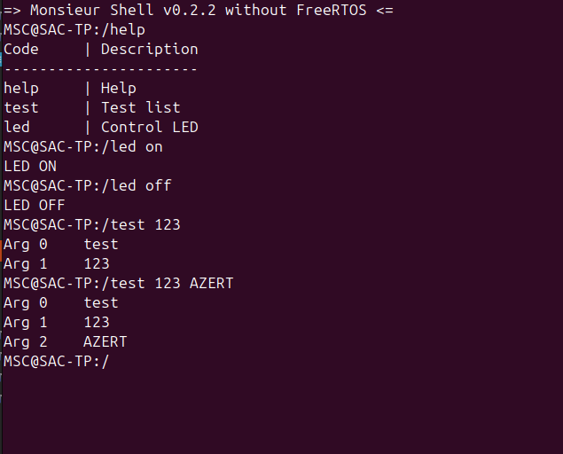
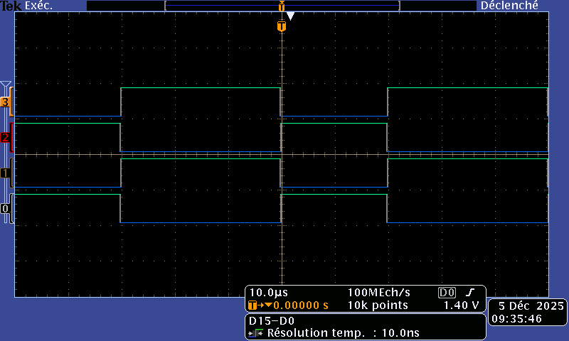
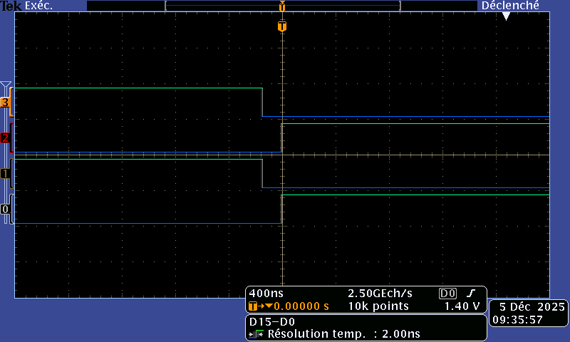

# CR TP Système d'acquisition 

## Sédrenn Labrousse & Mohamed Amin El Haid

### Présentation
Dans le cadre du module de Systèmes Asservis Commandés (SAC), ce travail pratique a pour objectif de mettre en œuvre la commande d’un hacheur complet à l’aide d’une carte Nucleo-STM32G474RE.
L’objectif principal est de réaliser la commande complémentaire décalée des quatre transistors du hacheur, d’assurer l’acquisition des capteurs, puis de développer un asservissement en temps réel.
Le projet est mené à travers un environnement STM32CubeIDE, entièrement versionné sur un dépôt GitHub partagé avec l’enseignant dès la première séance.

--- 
# Préparation prise en main 
### Test du Shell

Après avoir branché la carte et lancé un terminal (dans mon cas, minicom) nous pouvons tester le Shell proposé dans le code :

On voit bien sur la paillasse le on et off de la led et la fonction test renvoie les valeurs demandées.

--- 
# 6. Commande MCC basique
## 6.1. Génération de 4 PWM

### dead time
Pour le temps mort minimum nous allons nous référer à la data sheet des transistors utilisés : IRF540N
On rappelle qu'un deadtime minimal doit couvrir le temps nécessaire pour que le transistor précédemment conducteur soit réellement fermé avant d’activer l’autre transistor

Sur la datasheet on trouve :  
td(on) Turn-On Delay Time –––   11 ns–––  
tr Rise Time –––                35 ns–––  
td(off) Turn-Off Delay Time ––– 39 ns–––   
tf Fall Time –––                35 ns––– 

Donc pour un transistor seul, on a comme temps pour cesser la conduction :  
td(off) + tf + td(on)= 39 ns + 35 ns + 11 ns = 85 ns

Pour la partie Drain-Source :  
trr Reverse Recovery Time ––– 115 ––– max  170 ns

Donc on sait que théoriquement le transistor peut avoir des résidus de courant pendant 244ns.  
Un Dead time recommandé pourrait être 300ns

On sait que notre PWM est à 20kHz, donc avec des périodes de 50us.

On se fixera sur un dead time de 120ns environ.

### Génération
On génère 4 PWM : 

Avec le dead time convenu : 

Mais ces dernières ne pourront pas marcher. Le deuxième signal (1N) doit etre le complémentaire du premier (1) ce qui est le cas. 
Mais le 3 eme signal (2) doit etre égal à la complementaire de 1 (1N) fois (t-T/2) ou T est la période.
Donc décalé de 180 degré. 

